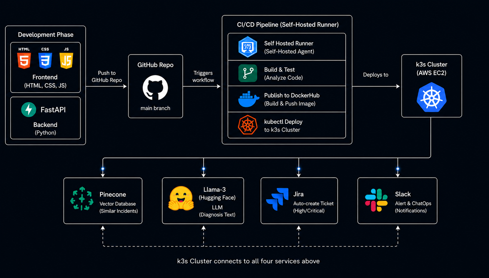
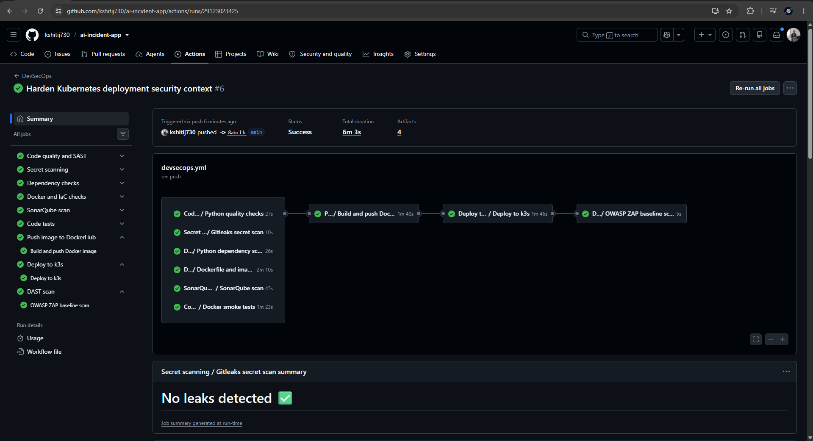
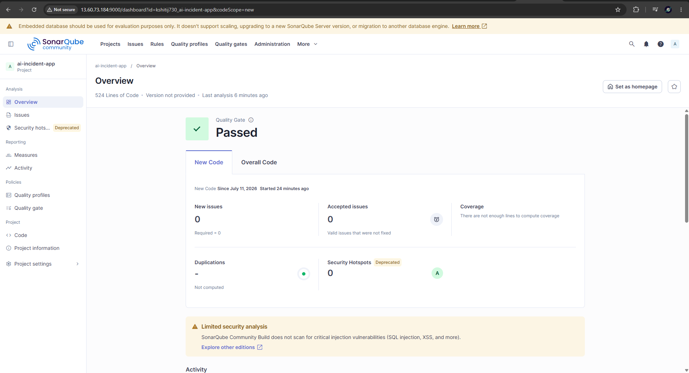
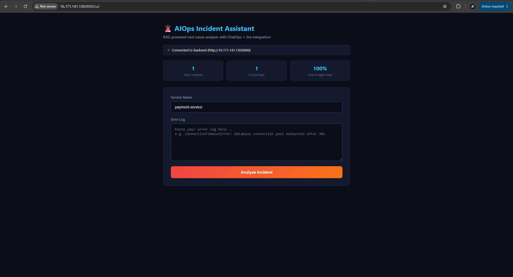
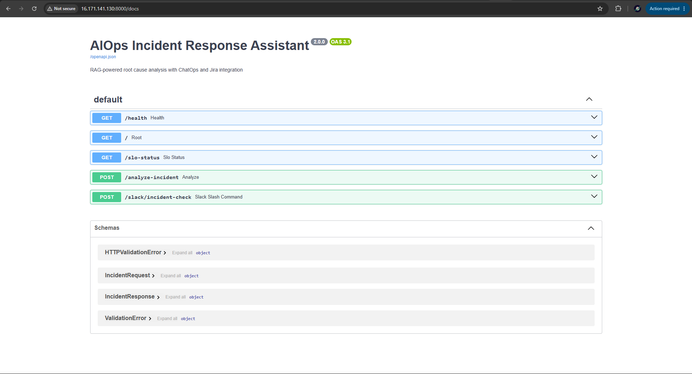
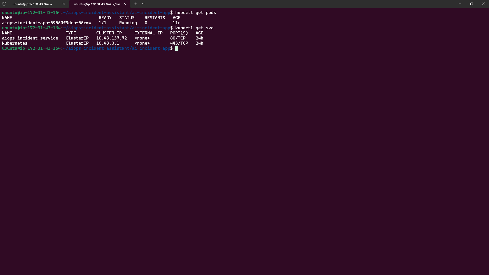
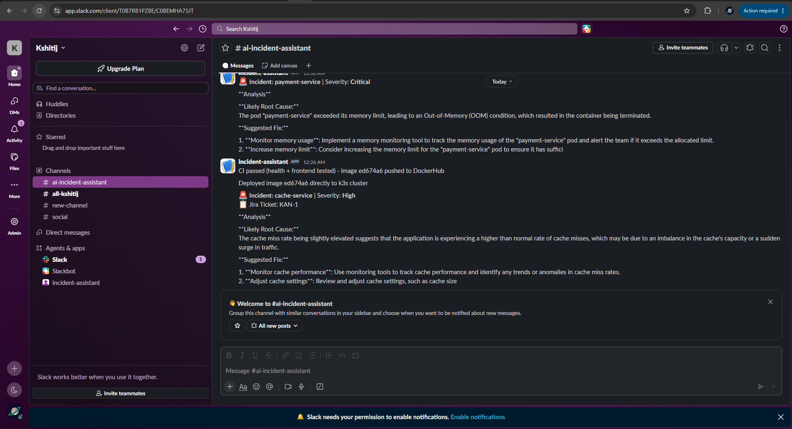
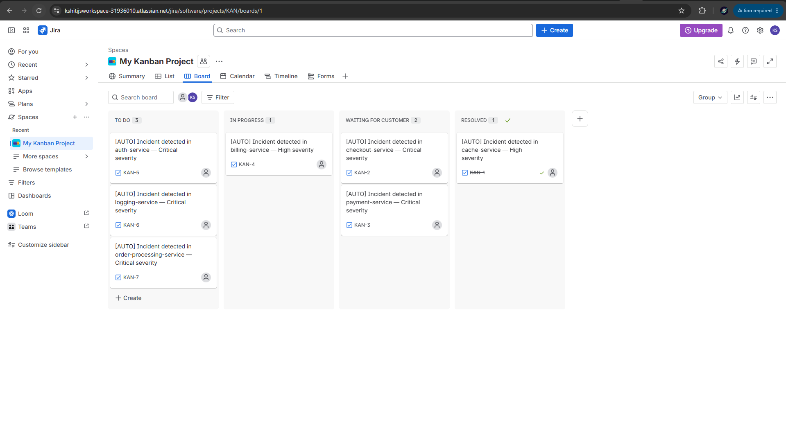
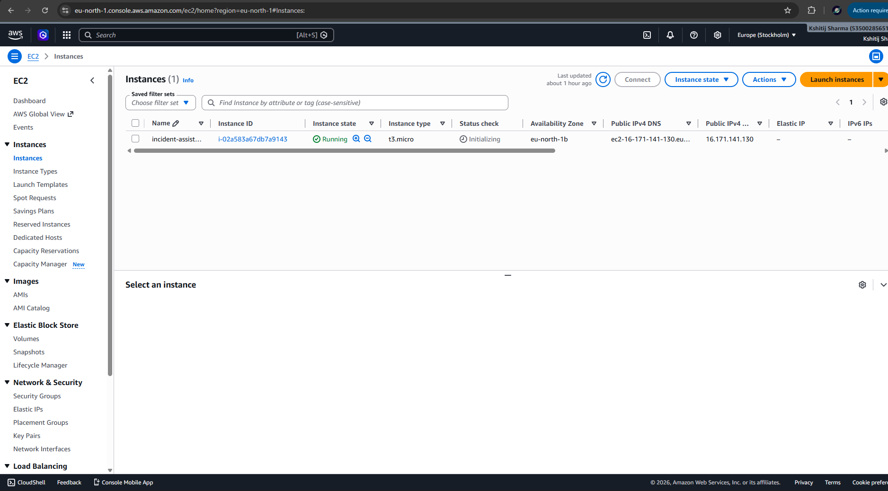

# 🚨 AIOps Incident Response Assistant

> A production-style, RAG-powered incident diagnosis platform built to demonstrate end-to-end DevOps + AIOps engineering — from CI/CD and Kubernetes orchestration to ChatOps automation and SRE observability practices.


---

## 📌 Table of Contents

- [Overview](#overview)
- [Problem Statement](#problem-statement)
- [Architecture](#architecture)
- [System Design](#system-design)
- [Tech Stack](#tech-stack)
- [Features](#features)
- [DevOps Skills Demonstrated](#devops-skills-demonstrated)
- [AI/ML (AIOps) Skills Demonstrated](#aiml-aiops-skills-demonstrated)
- [Repository Structure](#repository-structure)
- [CI/CD Pipeline](#cicd-pipeline)
- [DevSecOps Workflow Breakdown](#devsecops-workflow-breakdown)
- [DevSecOps Setup Guide](#devsecops-setup-guide)
- [Setup & Installation](#setup--installation)
- [API Reference](#api-reference)
- [ChatOps Usage (Slack)](#chatops-usage-slack)
- [SRE / Observability](#sre--observability)
- [Screenshots](#screenshots)
- [Known Limitations & Trade-offs](#known-limitations--trade-offs)
- [Future Improvements](#future-improvements)
- [Author](#author)

---

## Overview

**AIOps Incident Response Assistant** is a self-hosted platform that automatically analyzes production error logs using a Retrieval-Augmented Generation (RAG) pipeline, surfaces a root-cause diagnosis, opens a Jira ticket for high-severity issues, and notifies the team on Slack — all triggered either from a web dashboard or directly from a Slack slash command (ChatOps).

The entire system is containerized, deployed on a lightweight **k3s** Kubernetes cluster running on a single AWS EC2 instance (free-tier friendly), with an automated CI/CD pipeline built on **GitHub Actions** using a **self-hosted runner** for direct in-cluster deployment.

> ⚠️ **Note on availability:** This project runs on a personal AWS EC2 instance which is **not kept running 24/7** to control costs. The live demo may not always be accessible — see the [Screenshots](#screenshots) section and demo video for a full walkthrough of the working system.

---

## Problem Statement

In real production environments, when a service throws an error, engineers spend significant time manually searching logs, documentation, and past incident history to identify the root cause. This project automates that workflow:

1. An error log is submitted (via dashboard or Slack).
2. The system retrieves semantically similar past incidents from a vector database (Pinecone).
3. An LLM (Llama 3, via Hugging Face) synthesizes a root-cause diagnosis and fix suggestion using that context.
4. Based on severity, a Jira ticket is automatically created and a Slack alert is sent.
5. SLO/error-budget metrics are tracked for every incident analyzed.

---

## Architecture

```
                          ┌─────────────────────────────┐
                          │         GitHub Repo         │
                          │  (app code + K8s manifests) │
                          └───────────────┬─────────────┘
                                          │ git push
                                          ▼
                          ┌─────────────────────────────┐
                          │      GitHub Actions CI      │
                          │  Build → Smoke Test → Push  │
                          │        (DockerHub)          │
                          └───────────────┬─────────────┘
                                          │
                                          ▼
                          ┌──────────────────────────────┐
                          │  Self-Hosted Runner (on EC2) │
                          │   kubectl set image (CD)     │
                          └───────────────┬──────────────┘
                                          ▼
        ┌───────────────────────────────────────────────────────────┐
        │                     k3s Cluster (EC2, t3.micro)           │
        │                                                           │
        │   ┌─────────────────────────────────────────────────────┐ │
        │   │        FastAPI App (aiops-incident-app)             │ │
        │   │  ┌──────────────┐  ┌───────────────┐                │ │
        │   │  │ /analyze-    │  │ /slack/       │  /ui (frontend)│ │
        │   │  │  incident    │  │ incident-check│                │ │
        │   │  └──────┬───────┘  └──────┬────────┘                │ │
        │   │         │                 │                         │ │
        │   │         ▼                 ▼                         │ │
        │   │   ┌──────────────────────────────┐                  │ │
        │   │   │   RAG Pipeline (log_analyzer)│                  │ │
        │   │   │  Pinecone (retrieval) +      │                  │ │
        │   │   │  HF Llama-3 (generation)     │                  │ │
        │   │   └──────────────────────────────┘                  │ │
        │   │         │                                           │ │
        │   │         ▼                                           │ │
        │   │   Jira ticket (jira_client) + Slack webhook         │ │
        │   └─────────────────────────────────────────────────────┘ │
        │                                                           │
        │   ConfigMap + Secret  |  Service (NodePort)  |  Ingress   │
        └───────────────────────────────────────────────────────────┘
                                          │
                                          ▼
                              End user / Slack / Browser
```
---
## System Design



---

## Tech Stack

| Layer | Technology |
|---|---|
| API Framework | Python, FastAPI, Uvicorn |
| AI / RAG | LangChain, Pinecone (vector DB), Hugging Face Serverless Inference (Llama-3-8B-Instruct) |
| Containerization | Docker (single-stage, non-root user) |
| Orchestration | Kubernetes via **k3s** (lightweight distro, ~1GB RAM footprint) |
| CI/CD | GitHub Actions (cloud runner for CI, **self-hosted runner** for CD) |
| Container Registry | DockerHub |
| ChatOps | Slack Slash Commands + Incoming Webhooks |
| Issue Tracking | Jira Cloud REST API (auto-ticket creation) |
| Cloud Infra | AWS EC2 (t3.micro, 20GB EBS) |
| Networking | Security Groups, NodePort Service, Traefik Ingress (k3s built-in) |
| Scripting | Bash (deploy, health-check, rollback automation) |
| Observability (designed) | Prometheus + Grafana (see [Limitations](#known-limitations--trade-offs)) |

---

## Features

- 🔍 **RAG-based root cause analysis** — retrieves similar past incidents and generates a structured diagnosis (root cause, fix steps, severity)
- 💬 **ChatOps** — `/incident-check <service> <error>` Slack command triggers analysis without opening a dashboard
- 🎫 **Automated Jira ticketing** — Critical/High severity incidents automatically open a prioritized Jira issue
- 📊 **SLO / Error Budget tracking** — `/slo-status` endpoint reports total incidents, critical count, and error budget consumed
- 🔔 **Slack alerting** — every analyzed incident posts a formatted alert to a Slack channel
- 🖥️ **Self-service dashboard** — lightweight frontend served directly from the FastAPI app (`/ui`), auto-detects the backend origin (no manual config)
- 🩺 **Health & readiness probes** — Kubernetes-native liveness/readiness checks on `/health`

---

## DevOps Skills Demonstrated

| Area | Implementation |
|---|---|
| **CI** | GitHub Actions workflow: build → containerized smoke tests (health + frontend) → push to DockerHub |
| **CD** | Direct `kubectl set image` + `kubectl rollout status` deployment via a **self-hosted GitHub Actions runner** running on the target EC2 instance |
| **Containerization** | Single-stage, non-root Dockerfile optimized for a small image footprint (no heavy ML frameworks — LLM calls happen over HTTP, not locally) |
| **Orchestration** | k3s (lightweight Kubernetes) — Deployments, Services, ConfigMaps, Secrets, Ingress, health probes |
| **GitOps principles** | Declarative K8s manifests version-controlled in Git; `Recreate` deployment strategy chosen deliberately for a memory-constrained single-node cluster |
| **Networking** | AWS Security Groups, NodePort service exposure, Traefik Ingress (k3s built-in), VPC/EC2 public IP access |
| **Secrets Management** | Kubernetes Secrets kept out of Git via `.gitignore`; `secrets.yaml.example` committed as a template; real secrets applied manually / via `kubectl create secret` |
| **Shell Scripting** | `scripts/deploy.sh`, `scripts/health-check.sh` (with retry logic), `scripts/rollback.sh` (K8s native rollback) |
| **ChatOps** | Slack slash command wired directly into the FastAPI backend |
| **Issue Tracking Integration** | Jira REST API v3 integration for automatic incident ticketing |
| **SRE Practices** | SLO/error-budget endpoint, severity-based alert routing, resource requests/limits tuned for a 1GB RAM node |
| **Resource-aware engineering** | Deliberately scoped Prometheus/Grafana out of the current deployment after diagnosing it as the primary cause of API-server instability on a t3.micro node — documented as a trade-off rather than silently skipped |

---

## AI/ML (AIOps) Skills Demonstrated

| Area | Implementation |
|---|---|
| **Retrieval-Augmented Generation** | LangChain-orchestrated pipeline: embed → retrieve (Pinecone) → augment prompt → generate (Llama-3) |
| **Vector Search** | Pinecone free-tier index storing past incident embeddings + resolutions |
| **LLM Integration** | Hugging Face Serverless Inference API (no local model weights, no GPU required) |
| **Prompt Engineering** | Structured prompt enforcing root cause / fix steps / severity output format |
| **Severity Classification** | Diagnosis text parsed to extract severity, used to drive downstream automation (Jira priority mapping) |

---

## Repository Structure

```
ai-incident-app/
|-- .github/workflows/
|   |-- code-quality.yml       # Python quality checks and SAST
|   |-- code-tests.yml         # Docker build and smoke tests
|   |-- dast.yml               # OWASP ZAP DAST scan
|   |-- dependency-scan.yml    # Python dependency vulnerability scan
|   |-- deploy.yml             # k3s deployment via self-hosted runner
|   |-- devsecops.yml          # Main orchestrator workflow
|   |-- docker-push.yml        # DockerHub build and push
|   |-- docker-scans.yml       # Dockerfile, image, and IaC scans
|   |-- matrix.yml             # Manual Python version matrix check
|   |-- secret-scanning.yml    # Gitleaks secret scanning
|   `-- sonar-scan.yml         # Optional SonarQube scan
|-- app/
|   |-- main.py                # FastAPI app, routes, SLO tracking, ChatOps endpoint
|   |-- log_analyzer.py        # RAG pipeline (Pinecone retrieval + Llama-3 generation)
|   |-- jira_client.py         # Jira REST API integration
|   `-- requirements.txt
|-- frontend/
|   `-- index.html            # Self-service dashboard, served at /ui
|-- k8s-manifests/
|   |-- deployment.yaml
|   |-- service.yaml
|   |-- configmap.yaml
|   |-- secrets.yaml.example   # Template only - real file is gitignored
|   `-- ingress.yaml
|-- scripts/
|   |-- deploy.sh
|   |-- health-check.sh
|   `-- rollback.sh
|-- Dockerfile
|-- .dockerignore
|-- .gitignore
`-- README.md
```

---

## CI/CD Pipeline

**Trigger:** pushes and pull requests to `main`, but only when application, Docker, Kubernetes, script, or workflow files change. Documentation-only changes such as `README.md` do **not** start the pipeline.

**Main workflow - `devsecops.yml`**
1. Runs reusable security and quality workflows first: `code-quality.yml`, `secret-scanning.yml`, `dependency-scan.yml`, `docker-scans.yml`, and `sonar-scan.yml`
2. Runs `code-tests.yml` for Docker build and smoke tests
3. Runs `docker-push.yml` only after all checks pass on `main` pushes
4. Runs `deploy.yml` on the self-hosted k3s runner after the image is pushed
5. Runs `dast.yml` after deployment when `DAST_TARGET_URL` or `EC2_HOST` is configured

**Manual workflow - `matrix.yml`**
1. Manually checks Python compatibility across 3.10, 3.11, and 3.12

> **Why a self-hosted runner?** The k3s API server is only reachable from within the EC2 instance's private network. GitHub's cloud-hosted runners have no route to it, so the deploy step must execute on a runner physically located on the same machine as the cluster.

> **Design note — why not ArgoCD?** An initial version of this project used ArgoCD for GitOps-style pull-based delivery. On a 1GB RAM instance, running ArgoCD's control loop alongside the app and k3s itself pushed the node into repeated API-server timeouts. It was removed in favor of a simpler push-based `kubectl` deploy via a self-hosted runner — a deliberate trade-off documented here rather than hidden.

---

---

## DevSecOps Workflow Breakdown

This repository now follows a staged DevSecOps pipeline where security runs before build, push, and deployment. The workflows are intentionally split into small reusable files, similar to a production CI/CD setup, instead of keeping everything inside one large workflow file.

| Workflow | Purpose | Runs as |
|---|---|---|
| `code-quality.yml` | Python compile checks + Bandit SAST | Reusable workflow |
| `secret-scanning.yml` | Gitleaks scan to detect committed secrets | Reusable workflow |
| `dependency-scan.yml` | pip-audit scan for vulnerable Python dependencies | Reusable workflow |
| `docker-scans.yml` | Hadolint, Trivy image scan, and Trivy Kubernetes IaC scan | Reusable workflow |
| `sonar-scan.yml` | SonarQube/SonarCloud code quality and security analysis | Reusable workflow |
| `code-tests.yml` | Docker build + API/frontend smoke tests | Reusable workflow |
| `docker-push.yml` | Pushes the verified image to DockerHub | Reusable workflow |
| `deploy.yml` | Deploys to k3s from the self-hosted runner | Reusable workflow |
| `dast.yml` | OWASP ZAP baseline scan after deployment | Reusable/manual workflow |
| `devsecops.yml` | Main orchestrator that connects all gates | Entry workflow |
| `matrix.yml` | Manual Python version compatibility check | Manual workflow |

**Execution order:**

```text
code quality + SAST
        + secret scan
        + dependency scan
        + Docker/IaC scan
        + SonarQube scan
        + smoke tests
                ->
          DockerHub push
                ->
          k3s deployment
                ->
          OWASP ZAP DAST
```

**Path filtering:** documentation-only commits such as `README.md` changes do not trigger the pipeline. The workflow runs only when application code, Docker, Kubernetes manifests, scripts, or workflow files change.

---

## DevSecOps Setup Guide

### SonarQube setup on EC2

Run SonarQube Community Edition as a container on the EC2 instance:

```bash
docker run -d --name sonarqube-server -p 9000:9000 sonarqube:community
```

Then open:

```text
http://<EC2_PUBLIC_IP>:9000
```

Default login is `admin / admin`, and SonarQube will ask you to change the password on first login. Make sure port `9000` is allowed in the EC2 security group while configuring it.

### SonarQube GitHub secrets

Create a token from SonarQube:

```text
Profile -> My Account -> Security -> Generate Token
```

Add these repository secrets in GitHub:

| Secret | Value |
|---|---|
| `SONAR_TOKEN` | SonarQube user token |
| `SONAR_HOST_URL` | SonarQube server URL, for example `http://<EC2_PUBLIC_IP>:9000` |

The workflow automatically sets the project key from the repository name, so a separate `sonar-project.properties` file is not required for this demo.

### DockerHub secrets

Add these repository secrets for image publishing:

| Secret | Value |
|---|---|
| `DOCKERHUB_USERNAME` | DockerHub username |
| `DOCKERHUB_TOKEN` | DockerHub access token |

### Slack notification secret

Add this secret if you want CI/CD notifications:

| Secret | Value |
|---|---|
| `SLACK_WEBHOOK_URL` | Slack incoming webhook URL |

### DAST target configuration

OWASP ZAP needs a reachable deployed URL after CD. Configure one of these secrets:

| Secret | Purpose |
|---|---|
| `DAST_TARGET_URL` | Full deployed app URL, preferred |
| `EC2_HOST` | EC2 public IP/DNS fallback used as `http://<EC2_HOST>` |

### Self-hosted runner for deployment

The `deploy.yml` workflow runs on the EC2 self-hosted runner because the k3s cluster is local/private to that instance. The runner must have:

- `kubectl` installed
- access to `/home/ubuntu/.kube/config`
- permission to update the `aiops-incident-app` Kubernetes Deployment


## Setup & Installation

### Prerequisites
- AWS EC2 instance (t3.micro or larger, Ubuntu, 20GB+ EBS volume)
- Docker, kubectl, Helm installed
- Accounts: [Pinecone](https://pinecone.io) (free tier), [Hugging Face](https://huggingface.co) (free API token), DockerHub, Slack workspace, Jira Cloud (optional)

### 1. Install k3s

```bash
curl -sfL https://get.k3s.io | sh -
echo 'write-kubeconfig-mode: "0644"' | sudo tee -a /etc/rancher/k3s/config.yaml
sudo systemctl restart k3s

mkdir -p ~/.kube
sudo cp /etc/rancher/k3s/k3s.yaml ~/.kube/config
sudo chown $USER:$USER ~/.kube/config
export KUBECONFIG=~/.kube/config
kubectl get nodes
```

### 2. Clone the repo

```bash
git clone https://github.com/YOUR_USERNAME/ai-incident-app.git
cd ai-incident-app
```

### 3. Create secrets (never committed to Git)

```bash
kubectl create secret generic aiops-secrets \
  --from-literal=PINECONE_API_KEY='your-key' \
  --from-literal=HF_API_TOKEN='your-token' \
  --from-literal=SLACK_WEBHOOK_URL='your-webhook' \
  --from-literal=JIRA_BASE_URL='https://yourteam.atlassian.net' \
  --from-literal=JIRA_EMAIL='you@example.com' \
  --from-literal=JIRA_API_TOKEN='your-jira-token'
```

### 4. Apply manifests

```bash
kubectl apply -f k8s-manifests/configmap.yaml
kubectl apply -f k8s-manifests/deployment.yaml
kubectl apply -f k8s-manifests/service.yaml
kubectl apply -f k8s-manifests/ingress.yaml
```

### 5. Set up the self-hosted runner (for CD)

Follow **Settings → Actions → Runners → New self-hosted runner** in the GitHub repo, then:

```bash
sudo ./svc.sh install
sudo ./svc.sh start
```

### 6. Configure DockerHub + Slack secrets in GitHub

Repo → **Settings → Secrets and variables → Actions**:
`DOCKERHUB_USERNAME`, `DOCKERHUB_TOKEN`, `SLACK_WEBHOOK_URL`

### 7. Access the app

```bash
kubectl get svc
```

Via NodePort: `http://<EC2_PUBLIC_IP>:<NODE_PORT>/ui`

---

## API Reference

| Method | Endpoint | Description |
|---|---|---|
| `GET` | `/health` | Liveness/readiness check |
| `GET` | `/slo-status` | Total incidents, critical count, error budget consumed |
| `POST` | `/analyze-incident` | Main RAG diagnosis endpoint — body: `{ "error_log": "...", "service_name": "..." }` |
| `POST` | `/slack/incident-check` | Slack slash command webhook target |
| `GET` | `/ui` | Frontend dashboard |
| `GET` | `/docs` | Auto-generated FastAPI Swagger docs |

**Example request:**
```bash
curl -X POST http://<EC2_IP>:<PORT>/analyze-incident \
  -H "Content-Type: application/json" \
  -d '{"error_log": "OOMKilled: pod exceeded memory limit", "service_name": "payment-service"}'
```

---

## ChatOps Usage (Slack)

1. In Slack, create a slash command `/incident-check` pointing to `http://<EC2_IP>:<PORT>/slack/incident-check`
2. Use it directly in any channel:
   ```
   /incident-check payment-service Database connection pool exhausted after 30s
   ```
3. The bot analyzes the error and posts the diagnosis back into the channel — no dashboard required.

---

## SRE / Observability

- **`/slo-status`** exposes a lightweight error-budget view: total incidents analyzed vs. critical/high-severity incidents, calculated as a percentage against an implicit 99.9% uptime target.
- **Resource requests/limits** on the Deployment are deliberately tuned (128Mi request / 256Mi limit) to fit a 1GB RAM node without starving the k3s control plane.
- **`Recreate` deployment strategy** was chosen over `RollingUpdate` specifically because the node cannot support two replicas' worth of memory simultaneously during a rollout — a conscious SRE trade-off between deployment speed/availability and node stability.

---

## Screenshots

### DevSecOps Evidence

  
  


### Application & Deployment Evidence

  
  
  
  
  
  
  
---

## Known Limitations & Trade-offs

This project intentionally documents its constraints rather than hiding them — these were engineering decisions made under real resource limits (AWS free-tier, 1GB RAM):

- **EC2 is not always running** — to control cost, the instance is started on demand. The GitHub Actions CD job and any live demo links will only work while the instance is up.
- **No ArgoCD / GitOps pull-based delivery** — removed after it destabilized the k3s API server on a t3.micro node; replaced with a simpler push-based `kubectl` deploy via a self-hosted runner.
- **Prometheus/Grafana not deployed** — architected for, but excluded from the running system after it was identified as the largest single memory consumer on the node, causing repeated API-server timeouts. A production deployment would run this on a dedicated node or a t3.medium+ instance.
- **Single replica** — the Deployment runs `replicas: 1` rather than 2+, since the node cannot support the memory overhead of two applliction replicas at once alongside k3s system pods.
- **Secrets applied manually** — Kubernetes Secrets are excluded from Git and applied via `kubectl create secret`. A production setup would use Sealed Secrets, External Secrets Operator, or AWS Secrets Manager.

---

## Future Improvements

- [ ] Move to a larger instance (t3.medium+) and reintroduce lightweight Prometheus + Grafana
- [ ] Reintroduce GitOps (ArgoCD or Flux) once running on infrastructure that can support it
- [ ] Add Sealed Secrets or External Secrets Operator for proper secret management
- [ ] Add automated integration tests against a live Pinecone/HF sandbox in CI
- [ ] Multi-environment support (staging/prod namespaces)

---

## Author

**Kshitij Sharma**
B.Tech CSE (AKTU, 2025) — AI/ML & MLOps/DevOps Engineer
GitHub: [kshitij730](https://github.com/kshitij730)

---

*This project was built as a hands-on demonstration of production-style DevOps + AIOps practices under realistic free-tier resource constraints — every trade-off documented above was a deliberate engineering decision, not an oversight.*
